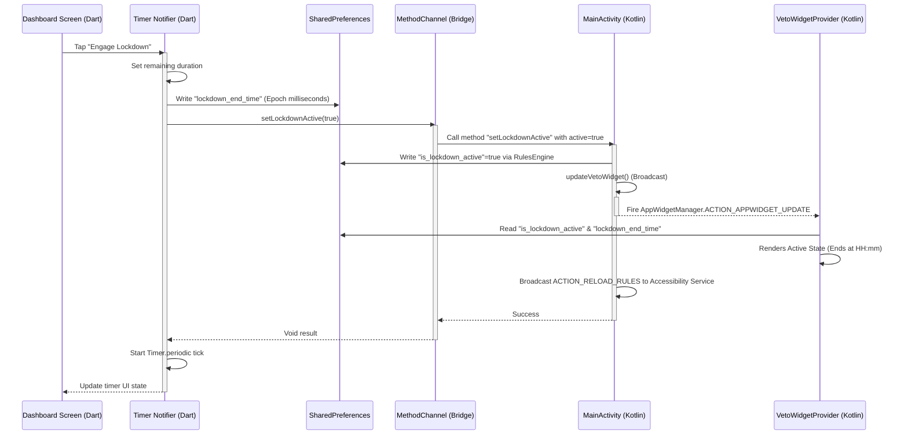
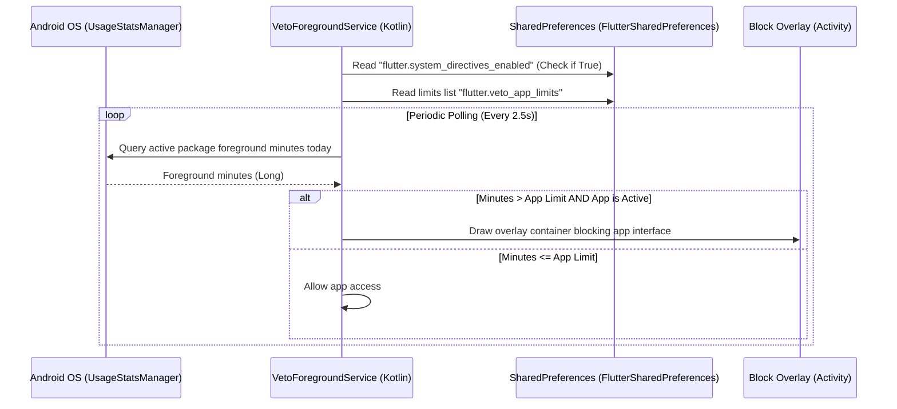
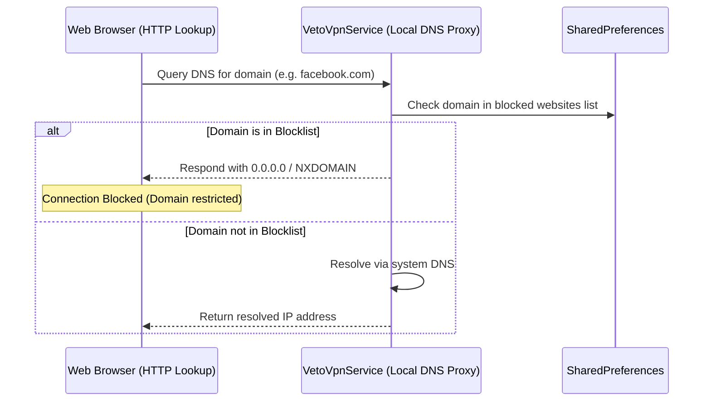

# Veto — System Architecture, Code Structure, and Usage Documentation

Veto is a premium, low-overhead digital wellbeing and distraction blocker application built on Flutter and native Android. It combines a Pomodoro-style deep lockdown timer with persistent, background-enforced system directives (application limits, website blocklists, and notification muting).

This document details the system architecture, file/directory structure, native integrations, data flow diagrams, and interactive usage instructions.

---

## 1. High-Level System Architecture

Veto uses a decoupled architecture where the **Flutter Layer** provides a fluid, obsidian-glass user interface, and the **Native Android Layer** handles the low-level system enforcements, scheduling, and widgets.

### System Diagram

```mermaid
graph TD
    %% Layers
    subgraph Flutter UI Layer
        UI[app.dart / Screens]
        Riverpod[State Providers]
        PrefsDart[SharedPreferences Dart]
    end

    subgraph Platform Bridge
        MethodChannel[MethodChannel: com.veto.app/bridge]
    end

    subgraph Native Android Layer
        MainActivity[MainActivity.kt]
        RulesEngine[VetoRulesEngine.kt]
        PrefsKotlin[SharedPreferences Android]
        AccessibilityService[VetoAccessibilityService.kt]
        ForegroundService[VetoForegroundService.kt]
        VpnService[VetoVpnService.kt]
        AlarmReceiver[VetoAlarmReceiver.kt]
        WidgetProvider[VetoWidgetProvider.kt]
    end

    %% Communication Flows
    UI --> Riverpod
    Riverpod --> PrefsDart
    Riverpod --> MethodChannel
    MethodChannel --> MainActivity
    
    %% Native interactions
    MainActivity --> RulesEngine
    MainActivity --> AlarmReceiver
    MainActivity --> WidgetProvider
    MainActivity --> ForegroundService
    MainActivity --> VpnService
    RulesEngine --> PrefsKotlin
    PrefsKotlin <--> PrefsDart : "Shared SharedPreferences File"
    
    AccessibilityService <--> PrefsKotlin : "Node-blocking check"
    ForegroundService <--> PrefsKotlin : "App limits check (UsageStatsManager)"
    VpnService <--> PrefsKotlin : "Website blocking (DNS intercept)"
    AlarmReceiver --> MainActivity : "Launch / Engage Intent"
    WidgetProvider --> MainActivity : "PendingIntent (Launch / Engage)"
    WidgetProvider --> PrefsKotlin : "Display ScreenTime & Rules"
```

### Data Storage & Process Communication
- **State Synchronization**: All background components share state using Android's private SharedPreferences (backed by `Context.MODE_PRIVATE`).
  - **`veto_rules` file**: Stores the active lockdown state (`is_lockdown_active`). Shared between `MainActivity`, `VetoRulesEngine`, `VetoAccessibilityService`, `VetoForegroundService`, and `VetoWidgetProvider`.
  - **`FlutterSharedPreferences` file**: Stores app limits, website filters, and planner schedule data written by Dart.
- **MethodChannel**: The bridge `com.veto.app/bridge` executes synchronous calls to write native settings, fetch usage statistics, query installed applications, toggle Do Not Disturb mode, control overlay permissions, and invoke timer lockdowns from incoming alarms/notifications.

---

## 2. Core Subsystems

### A. Accessibility Service (`VetoAccessibilityService`)
Operating in the background, the accessibility service acts as a targeted window node blocking engine:
1. **App Blocking & Traversal**: Reads active deep block rules (e.g. YouTube package rules). If a blocked node text or layout element (like `"Shorts"` or `"shorts_pivot_header"`) is encountered during window content layout traversal, it performs `GLOBAL_ACTION_BACK` to restrict access to that specific distraction.

### B. Foreground Service (`VetoForegroundService`)
Runs a persistent background thread to check application usage limits:
1. **App Limits Check**: Queries daily foreground time for configured packages using `UsageStatsManager` every 2.5 seconds. If a user exceeds their daily limit, it draws a full-screen glassmorphic system overlay (`TYPE_APPLICATION_OVERLAY`) that blocks interaction and guides them back to the launcher.

### C. Website Blocker VPN Service (`VetoVpnService`)
A lightweight, local-only VPN service that intercepts DNS resolution requests:
1. **DNS Filtering**: Runs a DNS proxy on 127.0.0.1 to intercept UDP port 53 traffic.
2. **Local Blocklist**: Resolves standard requests using system DNS but redirects blocked domains (e.g., `facebook.com`, `tiktok.com`) to `0.0.0.0` or returns NXDOMAIN to block access without external proxy routing.

### D. Alarms & Notifications (`VetoAlarmReceiver`)
Integrates directly with Android's `AlarmManager` for precise scheduling:
1. **Exact Reminders**: Schedules triggers for planner blocks (exactly at the block start time and 30 minutes prior).
2. **Actionable Alerts**: Fires high-priority alerts with quick actions ("Engage Lockdown") allowing users to lock down directly from the notification tray.
3. **SingleTop Navigation**: Tapping a notification or quick action brings the existing running activity to the foreground without resetting the app state or stopping active timers.

### E. Home Screen Widget (`VetoWidgetProvider`)
A premium glassmorphic control card that updates reactively:
1. **Obsidian Glass Design**: Designed with a translucent background shape, nested glass stat cards, and glowing status indicator pills.
2. **Live Usage Stats**: Computes today's cumulative screen time using `UsageStatsManager` and shows active system enforcements count dynamically.
3. **Countdown Synchronization**: Pulls the countdown target (`lockdown_end_time`) set by the Flutter timer and displays a static end time format (e.g., `Focusing (Ends 10:35 PM)`), avoiding battery drain.

---

## 3. Directory & File Structure

Below is the directory tree mapping out the structure of the Veto codebase:

```text
veto/
├── android/
│   └── app/
│       └── src/
│           └── main/
│               ├── AndroidManifest.xml          # Declares permissions, receivers, and service configs
│               ├── kotlin/com/veto/veto/
│               │   ├── MainActivity.kt          # MethodChannel endpoint & widget update broadcast trigger
│               │   ├── VetoAccessibilityService.kt # Targeted window element blocking (Shorts/Reels)
│               │   ├── VetoForegroundService.kt # App limits check and full-screen blocking overlay
│               │   ├── VetoVpnService.kt        # Local DNS proxy for domain filtering
│               │   ├── VetoAlarmReceiver.kt     # Broadcast receiver for scheduled planner notifications
│               │   ├── VetoRulesEngine.kt       # Decoupled reads/writes helper for veto_rules file
│               │   └── VetoWidgetProvider.kt    # Logic for rendering stats, status dot, and click intents
│               └── res/
│                   ├── drawable/
│                   │   ├── widget_background.xml               # Obsidian base with translucent border
│                   │   ├── widget_button_background.xml        # Emerald green accent engage button
│                   │   ├── widget_button_active_background.xml # Active translucent green border button
│                   │   ├── widget_stat_card_bg.xml             # Inner stat grids translucent card background
│                   │   ├── widget_status_badge_bg.xml          # Small upper pill border background
│                   │   ├── widget_status_active_dot.xml        # Glowing green circle shape
│                   │   └── widget_status_inactive_dot.xml      # Solid red indicator circle shape
│                   ├── layout/
│                   │   └── veto_widget_layout.xml              # Grid dashboard XML for widget layout
│                   └── xml/
│                       ├── accessibility_service_config.xml    # Accessibility config (package filters, flags)
│                       └── veto_widget_info.xml                # Widget provider metadata settings
│
└── lib/
    ├── main.dart                                # Riverpod container initializations and runApp
    ├── app.dart                                 # Main shell navigation shell, achievements, & control panel
    ├── bridge/
    │   └── veto_method_channel.dart             # Dart Platform MethodChannel wrapper API
    ├── core/
    │   ├── constants/
    │   │   └── app_constants.dart               # Colors (canvasBase, active green), SharedPreferences keys
    │   ├── theme/                               # Styling base tokens
    │   └── widgets/
    │       ├── ambient_background.dart          # Animated background graphic for obsidian visual style
    │       ├── animated_streak_flame.dart       # Multi-level CustomPaint flickering flame widget
    │       └── paywall_sheet.dart               # Premium feature bottom sheet for Veto Pro
    └── features/
        ├── dashboard/                           # PAGE 1 (Focus Lockdown Timer & Streak Stats)
        │   ├── presentation/
        │   │   ├── dashboard_screen.dart        # Radial slider, preset chips, and profiles selector
        │   │   └── widgets/
        │   │       ├── stats_pills.dart         # Usage, focus, and streak indicators
        │   │       ├── timer_centerpiece.dart   # Lock centerpiece with countdown and wind-down glow
        │   │       ├── emergency_bypass_sheet.dart # Modal sheet with 60s bypass friction delay
        │   │       └── weekly_report_card.dart  # Glassmorphic focus minutes capsule-based bar chart
        │   └── providers/
        │       ├── timer_provider.dart          # Countdown notifier, saves end time to shared prefs
        │       ├── blocked_apps_provider.dart   # List of app packages locked under Pomodoro
        │       ├── streak_provider.dart         # Focus streak count and weekly focus history state
        │       ├── subscription_provider.dart   # Simulated subscription status provider (Free vs Pro)
        │       └── usage_stats_provider.dart    # Exposes daily usage and focus stats dynamically
        │
        ├── planner/                             # PAGE 2 (Calendar Scheduling & Reminders)
        │   ├── presentation/
        │   │   └── planner_screen.dart          # Horizontal date scroll, schedule list card, schedule sheet
        │   └── providers/
        │       └── planner_provider.dart        # Scheduler state notifier, saves alerts, triggers AlarmManager
        │
        └── directives/                          # PAGE 3 (Background Limits & Enforcements)
            ├── presentation/
            │   └── directives_screen.dart       # App limits, website sheets, DND settings
            └── providers/
                ├── accessibility_provider.dart  # Riverpod notifier exposing Accessibility service status
                └── directives_provider.dart     # Manages app limits, websites, and master switches
```

---

## 4. Key Data Flows

### A. Pomodoro Lockdown Engagement Flow



### B. Persistent System Directives Limit Check Flow



### C. Website Domain Filtering Flow (Local VPN)



---

## 5. Interactive Usage Guide

### Page 1: Dashboard (Focus Lockdown & Streak Stats)
- **Select Duration**: Slide the radial lock ring or tap a preset chip (e.g., `25 min`, `1 hour`) to set your focus session time.
- **Engage Lockdown**: Tap the main lock toggle. Once activated, Veto enters lockdown mode:
  - Access to configured apps is deep-blocked by the native accessibility rules.
  - The home screen widget status transitions to green (`Active`) and shows the session end target.
- **Achievements & Badges**: Tapping the top left Trophy icon opens the Achievements bottom sheet. Unlocking streaks (3-day, 7-day, 14-day, 30-day) shows high-fidelity pulsing scale animations and unlocks active level-based flames.
- **Weekly Report**: Tracks focus statistics in a dynamic bar chart. Accumulating streak days changes the animated flame levels: Level 0 (Ember), Level 1 (Ignited), Level 2 (Blazing), and Level 3 (Supernova).

### Page 2: Planner (Scheduler & Alarms)
- **Schedule Session**: Tap `Add Schedule` to configure planned blocks.
  - **Date Selector**: Scroll horizontally through the calendar row. Tap a date to inspect or add blocks.
  - **Recurrence**: Toggle specific days of the week or choose `All Day` (applies the block from the selected date to the end of the current month).
- **Receive Notifications**: Veto fires system notifications at scheduled times. Tap `Engage Lockdown` on the notification card to lock down instantly.

### Page 3: System Directives (Persistent Enforcements)
- **Master Directives Switch**: Toggle this switch to activate or pause all background limits.
- **App Daily Limits**: Click `Add Limit` to select from a list of installed applications. Set a daily allowance. If you exceed this limit, Veto's Foreground Service locks the app for the rest of the day.
- **Website Domain Blocker**: Tap `Block Websites` to filter URLs. Veto redirects blacklisted domains to `0.0.0.0` locally using the DNS proxy VPN.
- **Block Notifications**: Mute incoming alerts by toggling Do Not Disturb directly from the control panel.

---

## 6. Permissions Required

To operate reliably, Veto requires the following Android permissions:
1. **Accessibility Service**: Required to monitor layout nodes for targeted deep-blocking (like YouTube Shorts/Reels) and perform back actions to block specific elements.
2. **Usage Stats Access**: Required to compute daily screen time and track usage limits for configured apps.
3. **System Alert Window (Draw Over Other Apps)**: Required by the Foreground Service to show overlay blocking windows when an app limit is exceeded.
4. **VPN Permission**: Required to establish the local DNS proxy service to intercept and filter website requests.
5. **Do Not Disturb (Notification Policy)**: Required to programmatically toggle DND mode and mute notification alerts.
6. **Schedule Exact Alarms**: Required to trigger exact background planner block reminders and alerts.
